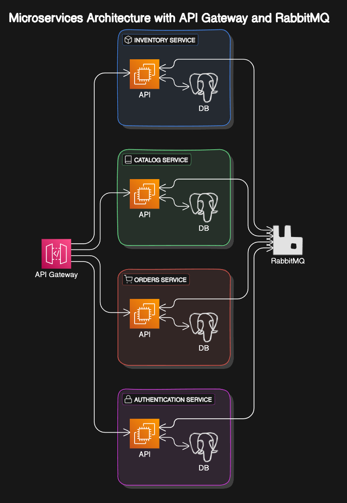

# Microservices Project

## Structure
This API project implements a microservices architecture.
Represents a pseudo-ecommerce of books

## Services
- InventoryAPI: Represents the stock of the books
- OrdersAPI: Takes the orders form the users
- CatalogAPI: Show the products to the users
- AuthenticationAPI: Implements authentication and authorization for the others services
- API-Gateway

Each service has its own postgres database.
RabbitMQ is used for the communication and consistency of data between services
To keep consistency of the data is through messages/events

### Structure

### Docker Containerization

### Technologies
- Entity Framework Core
- RabbitMQ
- Docker
- Postgres